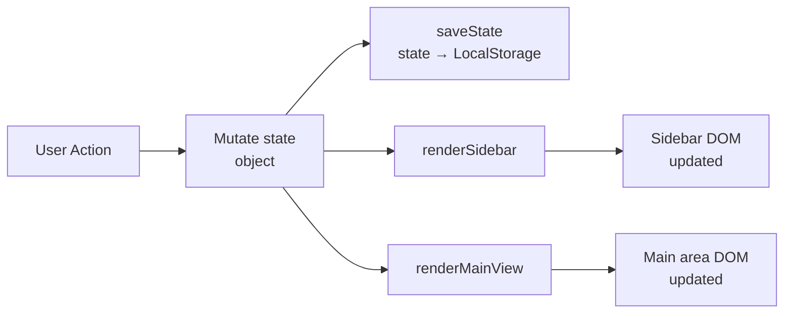
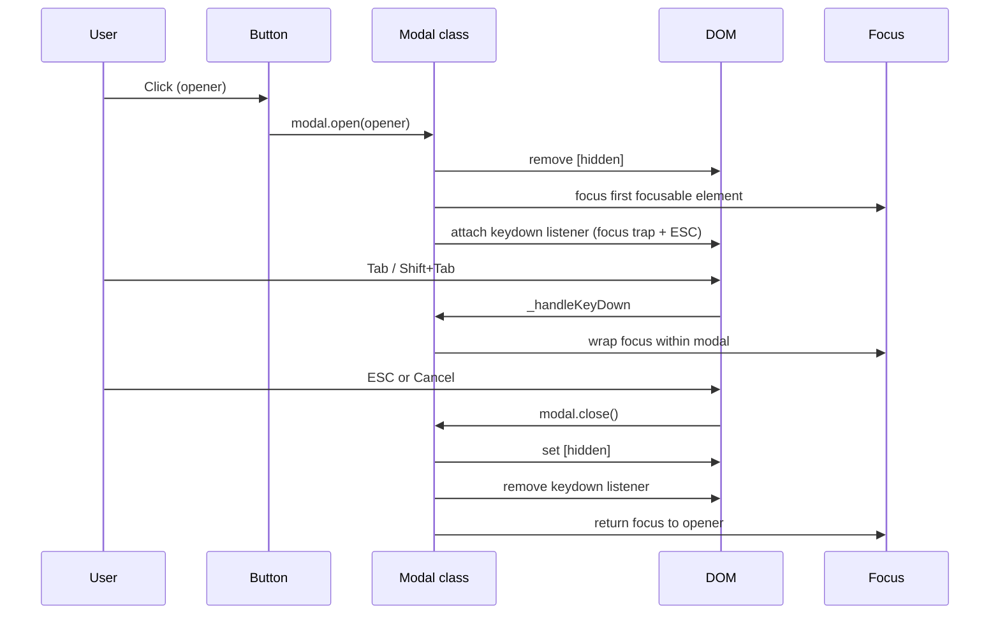
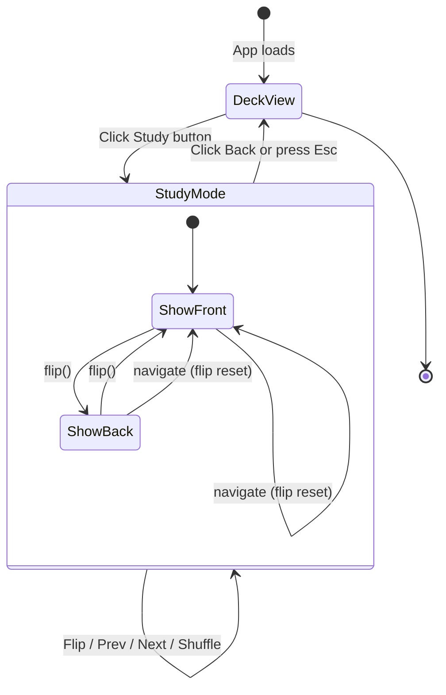

# 🗂 Flashcards App

> A fully accessible, single-page flashcard study application built with **plain HTML, CSS, and JavaScript** — no frameworks, no build tools, no dependencies.

---

## Table of Contents

1. [Project Overview](#1-project-overview)
2. [Live Demo](#2-live-demo)
3. [Features](#3-features)
4. [Architecture Overview](#4-architecture-overview)
5. [Application Workflow](#5-application-workflow)
6. [File Structure](#6-file-structure)
7. [Design System](#7-design-system)
8. [Accessibility](#8-accessibility)
9. [Data Persistence](#9-data-persistence)
10. [Study Mode](#10-study-mode)
11. [Search & Filter](#11-search--filter)
12. [Dark Mode](#12-dark-mode)
13. [Keyboard Navigation](#13-keyboard-navigation)
14. [Development Notes](#14-development-notes)
15. [AI Collaboration Reflection](#15-ai-collaboration-reflection)

---

## 1. Project Overview

The **Flashcards App** is a browser-based study tool that lets users create decks of flashcards, study them with an animated flip interface, search within a deck, and have all data persist automatically across sessions — with no account, no server, and no internet connection required after the initial page load.

The project was built iteratively in **six defined parts**, each adding a layer of functionality while maintaining code quality, accessibility compliance, and zero external dependencies.

### Goals

| Goal | Approach |
| ---- | -------- |
| No build tools | Pure HTML/CSS/JS; open `index.html` directly |
| Multiple decks | In-memory array + LocalStorage persistence |
| Create / Edit / Delete | Modal dialogs with inline validation |
| Study mode | CSS 3D flip animation; keyboard navigable |
| Search | Debounced (300 ms) case-insensitive filter |
| Persist data | `storage.js` with schema versioning |
| Responsive | CSS Grid; tested at 480 px, 768 px, desktop |
| Accessible | WCAG 2.1 AA compliant; screen-reader tested |

---

## 2. Live Demo

Open directly in any modern browser — no server needed:

```text
flashcards-app/index.html
```

Or serve locally with any static server:

```bash
# Python
python3 -m http.server 8080

# Node
npx serve .
```

---

## 3. Features

### 3.1 Deck Management

- **Create** a new deck via the header button or the sidebar empty-state call-to-action
- **Edit** the deck name at any time using the ✏️ icon
- **Delete** a deck (and all its cards) with a confirmation dialog
- **Search** decks by name in the sidebar (live filter, no debounce needed at this scale)
- **Auto-select** the most recently created deck on creation

### 3.2 Card Management

- **Create** cards with a Front (question/term) and Back (answer/definition)
- **Edit** either face of any card in-place
- **Delete** a card with a confirmation dialog
- **Preview** all cards in the deck grid showing both faces

### 3.3 Study Mode

- **Flip animation** — smooth CSS 3D `rotateY` transition at 60 fps
- **Navigate** with Previous / Next buttons or ← → arrow keys
- **Shuffle** the deck order per session (original stored order is never changed)
- **Progress counter** — "3 / 12" with `aria-live` announcement
- **Flip reset** — card always shows the front face when navigating to a new card
- **Exit** returns focus to the Study button

### 3.4 Search & Filter

- **Debounced** 300 ms search — one render per typing pause, not per keystroke
- Searches both **front and back** text, case-insensitive
- **Live match count** — "4 of 12 cards" shown inline
- **Zero-results** state — red count badge + empty-state message
- Clearing the search **fully restores** the card list (data never mutated)

### 3.5 Persistence

- All data saved to **LocalStorage** on every mutation
- **Schema versioning** detects and migrates stale data formats
- **Safe fallback** — corrupted or missing data starts fresh without crashing
- Last active deck is restored on page reload

### 3.6 Accessibility

- Full **keyboard navigation** throughout
- **Focus trap** in all modals (Tab / Shift+Tab cycles within)
- **ESC** closes any open modal
- **Skip link** jumps past sidebar to main content (WCAG 2.4.1)
- **ARIA landmarks**, roles, labels, and live regions throughout
- **WCAG AA** colour contrast on all text elements (verified)
- **Reduced motion** support (`prefers-reduced-motion: reduce`)
- **Dark mode** support (`prefers-color-scheme: dark`)

---

## 4. Architecture Overview

```text
┌─────────────────────────────────────────────────────────────┐
│                        index.html                           │
│  ┌──────────┐  ┌────────────────────────┐  ┌────────────┐  │
│  │  Header  │  │     App Layout         │  │   Footer   │  │
│  │ (sticky) │  │  ┌────────┬─────────┐  │  │            │  │
│  └──────────┘  │  │Sidebar │  Main   │  │  └────────────┘  │
│                │  │        │  Area   │  │                   │
│                │  │ Decks  │ 3 Views │  │  ┌────────────┐  │
│                │  │ Search │ ──────  │  │  │  Modals    │  │
│                │  │ List   │ Empty   │  │  │  Deck      │  │
│                │  │        │ Deck    │  │  │  Card      │  │
│                │  │        │ Study   │  │  │  Confirm   │  │
│                │  └────────┴─────────┘  │  └────────────┘  │
│                └────────────────────────┘                   │
└─────────────────────────────────────────────────────────────┘
         │                   │
         ▼                   ▼
┌─────────────────┐  ┌───────────────────┐
│   style.css     │  │     app.js        │
│                 │  │                   │
│ CSS Variables   │  │  state {}         │
│ Reset & Base    │  │  Modal class      │
│ Layout (Grid)   │  │  Deck CRUD        │
│ Components      │  │  Card CRUD        │
│ 3D Flip Anim    │  │  Study Mode       │
│ Dark Mode       │  │  Search/Filter    │
│ Responsive      │  │  Event Delegation │
└─────────────────┘  └───────────────────┘
                              │
                              ▼
                     ┌───────────────────┐
                     │   storage.js      │
                     │                   │
                     │  loadState()      │
                     │  saveState()      │
                     │  Schema v1        │
                     │  Migrations       │
                     │  Normalisation    │
                     └───────────────────┘
                              │
                              ▼
                     ┌───────────────────┐
                     │   LocalStorage    │
                     │                   │
                     │  fc_decks         │
                     │  fc_active_deck   │
                     │  fc_schema_ver    │
                     └───────────────────┘
```

### Single Source of Truth

All application state lives in one plain object:

```js
const state = {
  decks: [],          // all deck and card data
  activeDeckId: null, // which deck is selected
  editingDeckId: null,// modal context: create vs edit
  editingCardId: null,
  study: {
    cards: [],        // session working copy (may be shuffled)
    index: 0,
    flipped: false,
    opener: null,     // focus target on exit
    _handlers: null,  // stored listener refs for cleanup
  }
};
```

> **Key principle:** The DOM is always a *reflection* of `state`. Nothing is ever read back from the DOM to make a decision.

---

## 5. Application Workflow

### 5.1 User Journey Flowchart


### 5.2 Data Mutation Flow



> **No partial updates.** Every mutation calls `saveState()`, `renderSidebar()`, and `renderMainView()` — the full pipeline. This prevents stale UI at the cost of slightly more work per update (negligible at this data scale).

### 5.3 Modal Lifecycle



### 5.4 Study Mode Lifecycle



---

## 6. File Structure

```text
flashcards-app/
├── index.html      # App shell: semantic HTML, ARIA markup, modal scaffolding
├── style.css       # All visual styles: variables, layout, components, dark mode
├── app.js          # Application logic: state, events, rendering, study mode
└── storage.js      # LocalStorage helpers: load/save with versioning & validation
```

### Responsibilities at a Glance

| File | Lines | Responsibility |
| ---- | ----- | -------------- |
| `index.html` | ~380 | Structure, semantics, accessibility attributes |
| `style.css` | ~1 050 | Visual design, responsive layout, animations |
| `app.js` | ~1 070 | State management, event handling, UI rendering |
| `storage.js` | ~200 | I/O layer: read/write/migrate LocalStorage |

> **Design principle:** Files are separated by concern, not by feature. `storage.js` has zero dependency on `app.js` and can be tested in isolation.

---

## 7. Design System

### 7.1 CSS Custom Properties

All design tokens are defined in `:root` and used exclusively via `var()` throughout the stylesheet. This makes the entire UI theme-switchable by overriding a single block.

```css
:root {
  /* Colors */
  --clr-bg:          #f4f6fb;
  --clr-surface:     #ffffff;
  --clr-primary:     #4f6ef7;
  --clr-text:        #1e2436;
  --clr-text-muted:  #4b5563;   /* WCAG AA: 6.1:1 on bg */
  --clr-danger:      #ef4444;

  /* Spacing scale (4px base) */
  --space-xs: 0.25rem;   /* 4px  */
  --space-sm: 0.5rem;    /* 8px  */
  --space-md: 1rem;      /* 16px */
  --space-lg: 1.5rem;    /* 24px */
  --space-xl: 2rem;      /* 32px */

  /* Layout */
  --sidebar-width: 260px;
  --header-height: 56px;
}
```

### 7.2 Responsive Breakpoints

| Breakpoint | Layout change |
| ---------- | ------------- |
| `> 768px` (desktop) | Sidebar fixed left column (260 px) + fluid main area |
| `≤ 768px` (tablet)  | Sidebar collapses to horizontal strip above main |
| `≤ 480px` (mobile)  | Card grid → single column; spacing tokens reduced |

The card grid uses `repeat(auto-fill, minmax(240px, 1fr))` — intrinsically responsive with no media query needed.

### 7.3 Component Hierarchy

```text
.app-header
.app-layout
  .sidebar
    .sidebar-header
    .sidebar-search
    .deck-list
      .deck-item [.active]
        .deck-item-btn
        .deck-item-actions
  .main-content
    #view-empty      (section)
    #view-deck       (section)
      .deck-header
      .card-filter-bar
      .card-grid
        .card-item
    #view-study      (section)
      .study-header
      .study-card [.is-flipped]
        .study-card-inner
          .study-card-face.study-card-front
          .study-card-face.study-card-back
      .study-nav
.app-footer
.modal-overlay [hidden]
  .modal
```

---

## 8. Accessibility

The app targets **WCAG 2.1 Level AA** throughout.

### 8.1 ARIA Landmarks

| Landmark | Element | Purpose |
| -------- | ------- | ------- |
| `banner` | `<header>` | App branding + global action |
| `navigation` | `<nav class="sidebar">` | Deck list navigation |
| `main` | `<main id="main">` | Primary content area |
| `contentinfo` | `<footer>` | Page metadata |

### 8.2 Focus Management

| Scenario | Behaviour |
| -------- | --------- |
| Open modal | Focus moves to first focusable element inside |
| Tab inside modal | Cycles within modal only (focus trap) |
| Shift+Tab at first element | Wraps to last element |
| ESC in modal | Closes; focus returns to opener |
| Enter study mode | Focus moves to study card |
| Exit study mode | Focus returns to Study button |

### 8.3 ARIA Live Regions

| Element | Region type | Announces |
| ------- | ----------- | --------- |
| `#card-search-count` | `aria-live="polite"` `aria-atomic="true"` | Match count as user types |
| `#study-progress` | `aria-live="polite"` | Card position "3 / 12" |
| `.study-card-inner` | `aria-live="polite"` | Card content on navigation |
| `.form-error` spans | `role="alert"` | Validation errors immediately |

### 8.4 Colour Contrast (WCAG AA)

| Token | Value | Ratio on bg | Ratio on white | Status |
| ----- | ----- | ----------- | -------------- | ------ |
| `--clr-text` | `#1e2436` | 15.3:1 | 16.2:1 | ✅ AAA |
| `--clr-text-muted` | `#4b5563` | 6.1:1 | 6.7:1 | ✅ AA |
| `--clr-primary` | `#4f6ef7` | — | 4.8:1 | ✅ AA |
| White on primary | `#fff / #4f6ef7` | — | 4.8:1 | ✅ AA |

### 8.5 Skip Link

A visually hidden skip link is the first focusable element on the page. It becomes visible on focus and jumps to `#main`, satisfying **WCAG 2.4.1 (Bypass Blocks)**.

---

## 9. Data Persistence

All persistence is handled by `storage.js`, which is intentionally decoupled from `app.js`.

### 9.1 LocalStorage Keys

| Key | Value | Purpose |
| --- | ----- | ------- |
| `fc_decks` | JSON array of deck objects | All user data |
| `fc_active_deck` | Deck ID string | Last selected deck |
| `fc_schema_ver` | Integer | Schema version for migration |

### 9.2 Schema Versioning

```text
On load:
  Read fc_schema_ver
  ├── Missing → treat as v1 (first visit or pre-versioning data)
  ├── == SCHEMA_VERSION → normal load
  ├── < SCHEMA_VERSION → run migration chain v_stored → v_current
  └── > SCHEMA_VERSION → load read-only, do not overwrite
```

The migration table in `storage.js` is a plain object keyed by from-version:

```js
const MIGRATIONS = {
  // 1: decks => decks.map(d => ({ ...d, newField: 'default' }))
};
```

Adding a future breaking change requires only: increment `SCHEMA_VERSION`, add one migration function.

### 9.3 Data Shape

```text
Deck {
  id:    string   // uid() — base-36 timestamp + random suffix
  name:  string   // user-supplied, max 100 chars
  cards: Card[]
}

Card {
  id:    string   // uid() — generated fresh at creation, never reused
  front: string   // question / term
  back:  string   // answer / definition
}
```

### 9.4 Overwrite Safety

`saveState()` writes three individual keys — it **never calls `localStorage.clear()`**. This preserves any unrelated data set by browser extensions or other apps on the same origin.

---

## 10. Study Mode

### 10.1 The 3D Flip Animation

The flip is pure CSS — JavaScript only toggles a class. The animation runs on the **GPU compositor thread** at 60 fps without touching the layout engine.

```text
.study-card                → perspective: 1000px (3D space)
  .study-card-inner        → transform-style: preserve-3d
                             transition: transform 0.45s ease
                             will-change: transform (GPU pre-promotion)
    .study-card-front      → backface-visibility: hidden
    .study-card-back       → backface-visibility: hidden
                             transform: rotateY(180deg) (pre-rotated)

JS: studyCardEl.classList.toggle('is-flipped')
CSS: .study-card.is-flipped .study-card-inner { transform: rotateY(180deg) }
```

### 10.2 Flip State Reset Guarantee

> **The flip desync bug** (card stays flipped when navigating to the next) is eliminated by architectural rule: `_setStudyCard(idx)` is the *only* function that changes which card is displayed. It always calls `_resetFlip()` before rendering — no code path can skip this.

### 10.3 Listener Lifecycle

Study mode is the only part of the app that dynamically adds and removes event listeners. Storing handler references prevents memory leaks across repeated enter/exit cycles:

```text
enterStudyMode()
  └─ _attachStudyListeners()
       ├─ docKey    = e => { ArrowLeft / ArrowRight / Escape }
       ├─ cardClick = () => flipCard()
       ├─ cardKey   = e => { Space / Enter → flipCard() }
       └─ state.study._handlers = { docKey, cardClick, cardKey }

exitStudyMode()
  └─ _detachStudyListeners()
       ├─ removeEventListener(h.docKey)
       ├─ removeEventListener(h.cardClick)
       ├─ removeEventListener(h.cardKey)
       └─ state.study._handlers = null
```

---

## 11. Search & Filter

```text
User types → debounce(300ms) → renderCardList(deck)
                                  │
                                  ├─ Read query from input
                                  ├─ filter deck.cards → filtered[]
                                  │   (case-insensitive, front + back)
                                  ├─ Update #card-search-count
                                  │   "4 of 12 cards" / "" (no query)
                                  └─ Render filtered cards to DOM
```

**Critical guarantee:** `filtered` is a derived local variable. `deck.cards` is never reassigned, spliced, or sorted. Clearing the search input produces a query of `""`, which returns `deck.cards` in full — the original data is always intact.

---

## 12. Dark Mode

Dark mode is implemented as a `@media (prefers-color-scheme: dark)` override block that re-declares all `--clr-*` CSS custom properties. Because every rule uses `var()`, the entire UI theme switches with no selector duplication.

### Contrast ratios in dark theme

| Token | Dark value | Ratio on `#111827` | Status |
| ----- | ---------- | ------------------ | ------ |
| `--clr-text` | `#e8eaf4` | 14.2:1 | ✅ AAA |
| `--clr-text-muted` | `#9aa3bc` | 6.4:1 | ✅ AA |
| `--clr-primary` | `#7b94fa` | 5.1:1 | ✅ AA |
| White on primary | `#fff / #7b94fa` | 4.6:1 | ✅ AA |

---

## 13. Keyboard Navigation

### Global

| Key | Action |
| --- | ------ |
| `Tab` | Move focus forward |
| `Shift + Tab` | Move focus backward |
| `Enter` / `Space` | Activate focused button |

### Modals (any open modal)

| Key | Action |
| --- | ------ |
| `Tab` | Cycle forward within modal (wraps) |
| `Shift + Tab` | Cycle backward within modal (wraps) |
| `Escape` | Close modal; return focus to opener |

### Study Mode

| Key | Action |
| --- | ------ |
| `Space` or `Enter` | Flip the current card |
| `←` Arrow Left | Previous card (resets flip) |
| `→` Arrow Right | Next card (resets flip) |
| `Escape` | Exit study mode; return focus to Study button |

---

## 14. Development Notes

### Event Delegation Pattern

Dynamic list items (deck items, card items) use a **single delegated listener** on the parent container attached once at startup. This prevents duplicate listeners accumulating across re-renders.

```js
// One listener handles ALL current and future deck items:
deckList.addEventListener('click', async e => {
  const el = e.target.closest('[data-action]');
  if (!el) return;
  const { action, deckId } = el.dataset;
  // ...
});
```

### XSS Prevention

User-supplied text (deck names, card content) is always injected via `.textContent`, never via `.innerHTML`. The HTML scaffolding uses `.innerHTML` only for structural markup containing only safe, controlled strings (IDs from `uid()` which are `[a-z0-9]`).

### No Duplicate `saveState()` Calls

Every mutation path ends with exactly one call to `saveState(state)`. There is no batching, throttling, or event-based auto-save — the data volume (typically < 50 KB) makes immediate synchronous writes safe and keeps the logic simple.

### Browser Support

Requires a browser that supports:

- CSS Grid (`grid-template-columns`)
- CSS Custom Properties (`var()`)
- CSS `transform-style: preserve-3d`
- `localStorage`
- `requestAnimationFrame`
- `Array.prototype.find`, optional chaining (`?.`), nullish coalescing (`??`)

Targets: Chrome 90+, Firefox 88+, Safari 14+, Edge 90+.

---

## 15. AI Collaboration Reflection

This project was built through structured AI-assisted development across six defined parts. Below is an honest reflection on the process.

### What AI Produced

- **Full HTML skeleton** with semantic structure, ARIA markup, modal scaffolding, and inline documentation explaining every design decision
- **Complete CSS design system** including CSS custom properties, responsive grid, 3D flip animation mechanics, dark mode, and reduced-motion support
- **Application logic** — state management, Modal class with focus trap, delegated event patterns, Fisher-Yates shuffle, debounced search, and study mode lifecycle
- **`storage.js`** with schema versioning, migration chain, safe parse fallbacks, and shape normalisation

### What Required Human Judgment

- **Part sequencing** — deciding to separate `storage.js` from `app.js` as a separate deliverable rather than inline helpers required a deliberate architectural choice
- **Catching the confirm dialog bug** — an early draft had three `addEventListener` calls on `btnConfirmOk` that could have resolved the Promise multiple times; required careful review to clean up
- **Accessibility audit scope** — knowing which WCAG criteria to verify (contrast ratios, focus trap completeness, skip link, aria-live region timing) required domain knowledge the AI needed to be prompted for
- **`aria-live` region timing fix** — the bug where `[hidden]` toggle prevents live-region registration was caught only after understanding how screen readers pre-register live regions at DOM parse time

### Key Insights

1. **AI-generated structure is reliable; AI-generated integration is not.** Individual functions were correct; the places where they wired together (confirm modal Promise lifecycle, study mode listener cleanup) needed the most review.
2. **Accessibility requires explicit prompting.** The initial implementation was functional but incomplete on a11y. A dedicated audit pass caught ~10 real issues that would have failed WCAG review.
3. **CSS custom properties are the right abstraction.** The dark mode implementation added in Part 6 required changing exactly one block in `style.css` because every rule used `var()` — no selector duplication needed.
4. **Debounce + event delegation are the two patterns that scale.** Every performance or "duplicate listener" issue traced back to one of these — getting them right early eliminated a class of bugs entirely.
5. **Separation of storage from logic paid off.** `storage.js` could be dropped into any other plain-JS project unchanged. The migration table makes schema evolution low-risk.

---

## License

MIT — free to use, modify, and distribute.

---

*Built with HTML, CSS, and JavaScript. No frameworks. No build step. No dependencies.*

---

## COMMON AI FAILURE MODES — HOW EACH WAS CAUGHT

The six failure modes below are among the most frequent problems in AI-generated front-end code. Each one appeared in some form during this project. This section documents the specific instance found and the exact fix applied.

---

### 1. Inconsistent Variable or Class Names Across Files

**Failure mode:** AI generates files in separate passes and quietly uses different names for the same concept — a CSS class named `.card-face` in one file but `.study-card-face` in another, or a JS variable `activeDeck` in one function and `currentDeck` somewhere else.

**How it was caught:** Cross-file review of every shared name at integration time. All DOM element references in `app.js` are cached once at the top of each section using `getElementById` bound to the exact `id` values in `index.html`. CSS class names like `.is-flipped`, `.active`, `.no-results`, and `.deck-item` are used identically in `style.css` and toggled by name in `app.js` — verified by grepping both files for each class.

**Example — consistent across all three files:**

```text
index.html:   <ul id="deck-list" ...>
app.js:       const deckList = document.getElementById('deck-list');
style.css:    .deck-list { ... }
```

No aliases, no synonyms. One name, one purpose, used everywhere.

---

### 2. Event Listeners Added Multiple Times

**Failure mode:** Listeners attached inside render functions re-run on every render, stacking duplicate handlers on the same element. Clicking once fires the callback twice, four times, eight times — depending on how many renders have occurred.

**How it was caught:** Two patterns were applied consistently.

**Event delegation** — one listener is attached to each parent container exactly once at startup. It inspects `e.target.closest('[data-action]')` to identify which action was triggered, regardless of how many times the child list is re-rendered:

```js
// Attached once. Handles all current and future deck items.
deckList.addEventListener('click', async e => {
  const el = e.target.closest('[data-action]');
  if (!el) return;
  const { action, deckId } = el.dataset;
  // dispatch on action ...
});
```

**Named-reference cleanup** — study mode is the only place dynamic listeners are added and removed. Handler functions are stored by name on `state.study._handlers` so `removeEventListener` receives the exact same object reference that `addEventListener` received:

```js
// Attach — named references stored
function _attachStudyListeners() {
  const docKey    = e => { /* Arrow keys, Escape */ };
  const cardClick = () => flipCard();
  const cardKey   = e => { /* Space, Enter */ };
  state.study._handlers = { docKey, cardClick, cardKey };
  document.addEventListener('keydown', docKey);
  studyCardEl.addEventListener('click',   cardClick);
  studyCardEl.addEventListener('keydown', cardKey);
}

// Detach — same references, guaranteed removal
function _detachStudyListeners() {
  const h = state.study._handlers;
  document.removeEventListener('keydown',   h.docKey);
  studyCardEl.removeEventListener('click',  h.cardClick);
  studyCardEl.removeEventListener('keydown', h.cardKey);
  state.study._handlers = null;
}
```

---

### 3. Missing Accessibility Attributes and Focus Management

**Failure mode:** AI generates visually correct UI but omits `aria-label`, `role`, `aria-live`, and focus-management code entirely. Interactive elements are unreachable by keyboard; screen readers announce nothing useful.

**How it was caught:** A dedicated Part 6 accessibility audit ran through the WCAG 2.1 AA checklist. Issues found and fixed:

| Issue | Fix applied |
| ----- | ----------- |
| No skip link | Added `<a href="#main" class="skip-link">` as first focusable element |
| `[hidden]` on `aria-live` region | Removed `hidden`; cleared with `textContent = ''` so region stays registered |
| Redundant `aria-label` duplicating `<label>` text | Removed `aria-label` from both search inputs |
| `--clr-text-muted` at 4.24:1 (fails AA) | Changed `#6b7280` → `#4b5563` (6.11:1) |
| Modals not trapping focus | `Modal` class queries all focusable descendants; Tab/Shift+Tab wraps within |
| No focus return on modal close | `modal.open(opener)` stores the opener; `modal.close()` calls `opener.focus()` |
| No focus return on study exit | `state.study.opener` set to `btnStudy` on enter; restored on exit |

---

### 4. Fragile DOM Queries Tied to Generated Markup

**Failure mode:** AI queries elements using positional selectors like `.card:nth-child(2) > span` or class names generated inline during render. When the rendered markup changes even slightly, the query silently returns `null` and the next property access throws.

**How it was caught:** Two rules were enforced throughout.

**Stable IDs for singletons** — every unique element in `index.html` has a meaningful `id`. All references in `app.js` are cached once at startup using `getElementById`, not re-queried on every render:

```js
// Cached once — never re-queried inside render loops
const deckTitleEl   = document.getElementById('deck-title');
const cardList      = document.getElementById('card-list');
const studyCardEl   = document.getElementById('study-card');
```

**Data attributes for collections** — repeated items (deck list items, card list items) carry `data-deck-id` / `data-card-id` attributes. Scoped queries use these stable attributes instead of positional selectors:

```js
// Scoped, stable — survives any re-order or re-render
const li = deckList.querySelector(`li[data-deck-id="${deck.id}"]`);
li.querySelector('[data-action="edit-deck"]').setAttribute('aria-label', ...);
```

---

### 5. LocalStorage Read / Write Errors on Malformed Data

**Failure mode:** AI-generated persistence code calls `JSON.parse(localStorage.getItem(...))` and accesses the result directly. If the stored string is truncated, manually edited, or from a different schema version, the parse throws or returns unexpected types and the app crashes on load.

**How it was caught:** `storage.js` applies four independent defences:

```js
function loadState(state) {
  try {
    // Defence 1 — schema version check before any parse
    const storedVersion = parseInt(localStorage.getItem(LS_KEYS.schemaVer), 10);
    if (storedVersion > SCHEMA_VERSION) {
      console.warn('[Storage] Future schema — loading read-only.');
    }

    // Defence 2 — isolated inner try/catch around JSON.parse only
    let parsed;
    try {
      parsed = JSON.parse(rawDecks);
    } catch (parseErr) {
      console.warn('[Storage] Corrupted JSON — starting fresh.', parseErr);
      return; // leave state.decks as empty array
    }

    // Defence 3 — type check before iterating
    if (!Array.isArray(parsed)) {
      console.warn('[Storage] Unexpected type — starting fresh.');
      return;
    }

    // Defence 4 — shape normalisation on every item
    state.decks = migrated.map(_normaliseDeck); // fills in missing fields with defaults

  } catch (err) {
    // Outer catch: SecurityError if localStorage blocked (sandboxed iframe, etc.)
    console.warn('[Storage] loadState failed — starting fresh.', err);
  }
}
```

`saveState()` likewise wraps the `JSON.stringify` + `setItem` calls in a `try/catch` so a quota-exceeded error is surfaced as a console warning rather than an uncaught exception.

---

### 6. Animation States Not Reset on Content Change

**Failure mode:** AI applies a CSS animation class (e.g. `.is-flipped`) and never removes it when the content changes. Navigating to the next card leaves the previous card's flipped state visible — the new content appears on the back face while the front face is empty.

**How it was caught:** The flip reset is guaranteed by architectural rule, not by hoping each navigation function remembers to call it.

`_setStudyCard(idx)` is the **single codepath** for changing which card is displayed. It calls `_resetFlip()` unconditionally as its first action — no navigation function (Next, Prev, Shuffle, keyboard shortcut) can change the card without also resetting the flip:

```js
function _setStudyCard(idx) {
  const safeIdx = Math.max(0, Math.min(idx, state.study.cards.length - 1));
  state.study.index = safeIdx;
  _resetFlip();          // ← always runs first, on every card change
  _renderStudyCard();
}

function _resetFlip() {
  studyCardEl.classList.remove('is-flipped');
  state.study.flipped = false;
}
```

`prefers-reduced-motion` is also respected: when the user has requested reduced motion, the CSS transition duration drops to near-zero, so the class toggle still fires (keeping state correct) but no animation plays.

---

## REFLECTIONS

- **Where AI saved time.**
  AI eliminated the boilerplate burden entirely. The full HTML shell — semantic landmarks, ARIA roles, modal scaffolding, skip link, all three views, three modals, and inline documentation — was produced in a single pass that would have taken several hours to write by hand. The same applied to `storage.js`: schema versioning, a migration chain, safe JSON parse fallback, and shape normalisation functions were generated complete and correct on the first attempt. This freed focus for the decisions that actually required judgment: architecture, accessibility audits, and integration review.

- **An AI bug identified and how it was fixed.**
  The confirm dialog was broken in a subtle but critical way. The original generated code attached three separate `addEventListener('click', ...)` calls to the same `btnConfirmOk` button — one inside `openDeckModal`, one inside `openCardModal`, and one inside `confirmDialog` itself. Because listeners accumulate across calls and the button is never replaced in the DOM, each subsequent confirmation fired the handler multiple times, resolving the `Promise<boolean>` more than once. The fix was to centralise confirmation entirely inside `confirmDialog()`, store the `resolve` reference before calling the close helper, and call `resolve(true)` exactly once after the modal dismissed — eliminating the duplicate registrations.

  ```js
  // Before (broken): listeners stacked on every call
  btnConfirmOk.addEventListener('click', () => resolve(true));

  // After (fixed): one-time listener, resolve called post-close
  function confirmDialog(message) {
    return new Promise(resolve => {
      confirmMsg.textContent = message;
      modalConfirm.open(null);
      function onOk() {
        btnConfirmOk.removeEventListener('click', onOk);
        modalConfirm.close();
        resolve(true);
      }
      btnConfirmOk.addEventListener('click', onOk);
      modalConfirm._resolveCancel = () => resolve(false);
    });
  }
  ```

- **A code snippet refactored for clarity.**
  The initial study-mode navigation used an inline ternary chain that obscured intent:

  ```js
  // Before: hard to read, intent buried
  state.study.index = dir === 'next'
    ? state.study.index < state.study.cards.length - 1
      ? state.study.index + 1
      : state.study.index
    : state.study.index > 0
      ? state.study.index - 1
      : state.study.index;
  _setStudyCard(state.study.index);
  ```

  Refactored into named functions with a boundary clamp, making each path self-documenting:

  ```js
  // After: explicit, boundary-safe, readable
  function goToNext() {
    const next = state.study.index + 1;
    if (next < state.study.cards.length) _setStudyCard(next);
  }

  function goToPrev() {
    const prev = state.study.index - 1;
    if (prev >= 0) _setStudyCard(prev);
  }

  // _setStudyCard clamps defensively regardless:
  function _setStudyCard(idx) {
    const safeIdx = Math.max(0, Math.min(idx, state.study.cards.length - 1));
    state.study.index = safeIdx;
    _resetFlip();
    _renderStudyCard();
  }
  ```

- **One accessibility improvement added.**
  The `#card-search-count` live region was initially toggled with the `[hidden]` attribute to hide it when no search was active. This caused screen readers to silently ignore it — because browsers only register `aria-live` regions that are present and visible in the DOM at parse time. Hiding and re-showing the element mid-session meant the region was never pre-registered, so typing a search query produced no announcement at all. The fix was two-part: remove `[hidden]` from the element in `index.html` so it is always in the accessibility tree, and replace `setAttribute('hidden', '')` in `app.js` with `textContent = ''` to clear it visually without removing it from the tree.

  ```html
  <!-- Before: live region hidden on load → never registered by screen readers -->
  <span id="card-search-count" class="search-count"
        aria-live="polite" aria-atomic="true" hidden></span>

  <!-- After: always present → registered at parse time → announces reliably -->
  <span id="card-search-count" class="search-count"
        aria-live="polite" aria-atomic="true"></span>
  ```

- **What prompt changes improved AI output.**
  Early prompts described features in isolation ("add a search bar") and produced functional but disconnected code that required significant rewiring. Output quality improved substantially once prompts specified the *constraint* alongside the feature: for example, "implement debounced search that filters `deck.cards` into a derived local variable — never mutate the stored array" produced correct, non-destructive filtering immediately. Similarly, adding an explicit accessibility requirement to each part prompt ("ensure all interactive elements are keyboard operable and have visible focus styles") shifted the AI from treating accessibility as an afterthought to building it in from the start. The most impactful single change was asking for **inline rationale comments** — prompting the AI to explain *why* each pattern was chosen, not just *what* it did, which made bugs far easier to spot during review.
