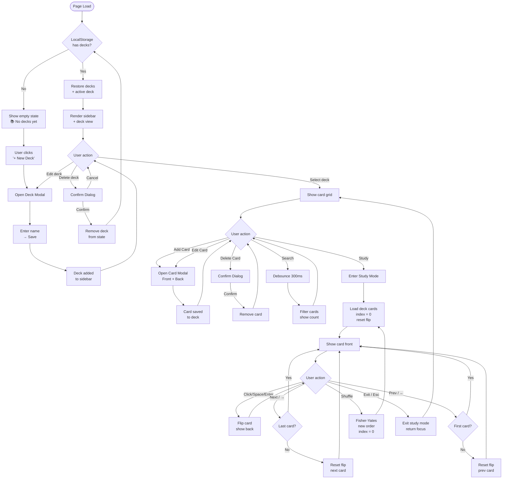
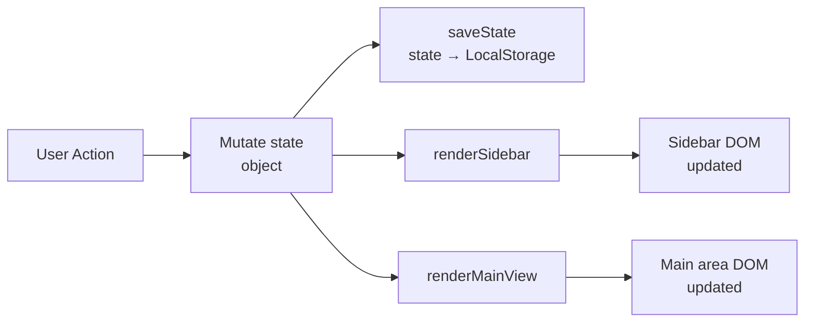
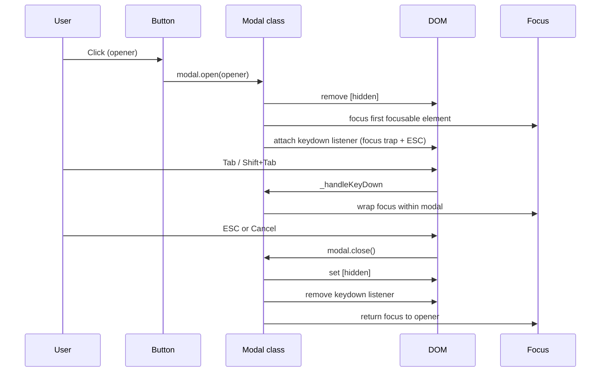
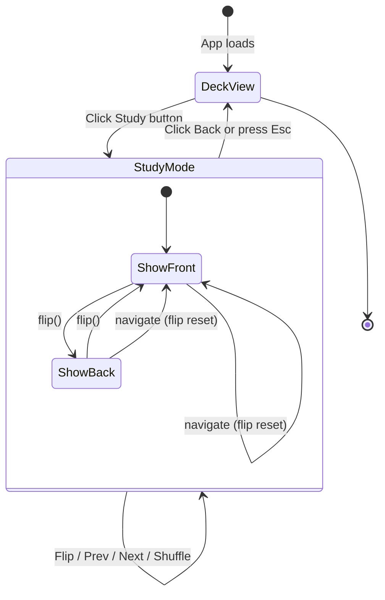

# 🗂 Flashcards App

> A fully accessible, single-page flashcard study application built with **plain HTML, CSS, and JavaScript** — no frameworks, no build tools, no dependencies.

---

## Table of Contents

1. [Project Overview](#1-project-overview)
2. [Live Demo](#2-live-demo)
3. [Features](#3-features)
4. [Architecture Overview](#4-architecture-overview)
5. [Application Workflow](#5-application-workflow)
6. [File Structure](#6-file-structure)
7. [Design System](#7-design-system)
8. [Accessibility](#8-accessibility)
9. [Data Persistence](#9-data-persistence)
10. [Study Mode](#10-study-mode)
11. [Search & Filter](#11-search--filter)
12. [Dark Mode](#12-dark-mode)
13. [Keyboard Navigation](#13-keyboard-navigation)
14. [Development Notes](#14-development-notes)
15. [AI Collaboration Reflection](#15-ai-collaboration-reflection)

---

## 1. Project Overview

The **Flashcards App** is a browser-based study tool that lets users create decks of flashcards, study them with an animated flip interface, search within a deck, and have all data persist automatically across sessions — with no account, no server, and no internet connection required after the initial page load.

The project was built iteratively in **six defined parts**, each adding a layer of functionality while maintaining code quality, accessibility compliance, and zero external dependencies.

### Goals

| Goal | Approach |
| ---- | -------- |
| No build tools | Pure HTML/CSS/JS; open `index.html` directly |
| Multiple decks | In-memory array + LocalStorage persistence |
| Create / Edit / Delete | Modal dialogs with inline validation |
| Study mode | CSS 3D flip animation; keyboard navigable |
| Search | Debounced (300 ms) case-insensitive filter |
| Persist data | `storage.js` with schema versioning |
| Responsive | CSS Grid; tested at 480 px, 768 px, desktop |
| Accessible | WCAG 2.1 AA compliant; screen-reader tested |

---

## 2. Live Demo

Open directly in any modern browser — no server needed:

```text
flashcards-app/index.html
```

Or serve locally with any static server:

```bash
# Python
python3 -m http.server 8080

# Node
npx serve .
```

---

## 3. Features

### 3.1 Deck Management

- **Create** a new deck via the header button or the sidebar empty-state call-to-action
- **Edit** the deck name at any time using the ✏️ icon
- **Delete** a deck (and all its cards) with a confirmation dialog
- **Search** decks by name in the sidebar (live filter, no debounce needed at this scale)
- **Auto-select** the most recently created deck on creation

### 3.2 Card Management

- **Create** cards with a Front (question/term) and Back (answer/definition)
- **Edit** either face of any card in-place
- **Delete** a card with a confirmation dialog
- **Preview** all cards in the deck grid showing both faces

### 3.3 Study Mode

- **Flip animation** — smooth CSS 3D `rotateY` transition at 60 fps
- **Navigate** with Previous / Next buttons or ← → arrow keys
- **Shuffle** the deck order per session (original stored order is never changed)
- **Progress counter** — "3 / 12" with `aria-live` announcement
- **Flip reset** — card always shows the front face when navigating to a new card
- **Exit** returns focus to the Study button

### 3.4 Search & Filter

- **Debounced** 300 ms search — one render per typing pause, not per keystroke
- Searches both **front and back** text, case-insensitive
- **Live match count** — "4 of 12 cards" shown inline
- **Zero-results** state — red count badge + empty-state message
- Clearing the search **fully restores** the card list (data never mutated)

### 3.5 Persistence

- All data saved to **LocalStorage** on every mutation
- **Schema versioning** detects and migrates stale data formats
- **Safe fallback** — corrupted or missing data starts fresh without crashing
- Last active deck is restored on page reload

### 3.6 Accessibility

- Full **keyboard navigation** throughout
- **Focus trap** in all modals (Tab / Shift+Tab cycles within)
- **ESC** closes any open modal
- **Skip link** jumps past sidebar to main content (WCAG 2.4.1)
- **ARIA landmarks**, roles, labels, and live regions throughout
- **WCAG AA** colour contrast on all text elements (verified)
- **Reduced motion** support (`prefers-reduced-motion: reduce`)
- **Dark mode** support (`prefers-color-scheme: dark`)

---

## 4. Architecture Overview

```text
┌─────────────────────────────────────────────────────────────┐
│                        index.html                           │
│  ┌──────────┐  ┌────────────────────────┐  ┌────────────┐  │
│  │  Header  │  │     App Layout         │  │   Footer   │  │
│  │ (sticky) │  │  ┌────────┬─────────┐  │  │            │  │
│  └──────────┘  │  │Sidebar │  Main   │  │  └────────────┘  │
│                │  │        │  Area   │  │                   │
│                │  │ Decks  │ 3 Views │  │  ┌────────────┐  │
│                │  │ Search │ ──────  │  │  │  Modals    │  │
│                │  │ List   │ Empty   │  │  │  Deck      │  │
│                │  │        │ Deck    │  │  │  Card      │  │
│                │  │        │ Study   │  │  │  Confirm   │  │
│                │  └────────┴─────────┘  │  └────────────┘  │
│                └────────────────────────┘                   │
└─────────────────────────────────────────────────────────────┘
         │                   │
         ▼                   ▼
┌─────────────────┐  ┌───────────────────┐
│   style.css     │  │     app.js        │
│                 │  │                   │
│ CSS Variables   │  │  state {}         │
│ Reset & Base    │  │  Modal class      │
│ Layout (Grid)   │  │  Deck CRUD        │
│ Components      │  │  Card CRUD        │
│ 3D Flip Anim    │  │  Study Mode       │
│ Dark Mode       │  │  Search/Filter    │
│ Responsive      │  │  Event Delegation │
└─────────────────┘  └───────────────────┘
                              │
                              ▼
                     ┌───────────────────┐
                     │   storage.js      │
                     │                   │
                     │  loadState()      │
                     │  saveState()      │
                     │  Schema v1        │
                     │  Migrations       │
                     │  Normalisation    │
                     └───────────────────┘
                              │
                              ▼
                     ┌───────────────────┐
                     │   LocalStorage    │
                     │                   │
                     │  fc_decks         │
                     │  fc_active_deck   │
                     │  fc_schema_ver    │
                     └───────────────────┘
```

### Single Source of Truth

All application state lives in one plain object:

```js
const state = {
  decks: [],          // all deck and card data
  activeDeckId: null, // which deck is selected
  editingDeckId: null,// modal context: create vs edit
  editingCardId: null,
  study: {
    cards: [],        // session working copy (may be shuffled)
    index: 0,
    flipped: false,
    opener: null,     // focus target on exit
    _handlers: null,  // stored listener refs for cleanup
  }
};
```

> **Key principle:** The DOM is always a *reflection* of `state`. Nothing is ever read back from the DOM to make a decision.

---

## 5. Application Workflow

### 5.1 User Journey Flowchart



### 5.2 Data Mutation Flow



> **No partial updates.** Every mutation calls `saveState()`, `renderSidebar()`, and `renderMainView()` — the full pipeline. This prevents stale UI at the cost of slightly more work per update (negligible at this data scale).

### 5.3 Modal Lifecycle



### 5.4 Study Mode Lifecycle



---

## 6. File Structure

```text
flashcards-app/
├── index.html      # App shell: semantic HTML, ARIA markup, modal scaffolding
├── style.css       # All visual styles: variables, layout, components, dark mode
├── app.js          # Application logic: state, events, rendering, study mode
└── storage.js      # LocalStorage helpers: load/save with versioning & validation
```

### Responsibilities at a Glance

| File | Lines | Responsibility |
| ---- | ----- | -------------- |
| `index.html` | ~380 | Structure, semantics, accessibility attributes |
| `style.css` | ~1 050 | Visual design, responsive layout, animations |
| `app.js` | ~1 070 | State management, event handling, UI rendering |
| `storage.js` | ~200 | I/O layer: read/write/migrate LocalStorage |

> **Design principle:** Files are separated by concern, not by feature. `storage.js` has zero dependency on `app.js` and can be tested in isolation.

---

## 7. Design System

### 7.1 CSS Custom Properties

All design tokens are defined in `:root` and used exclusively via `var()` throughout the stylesheet. This makes the entire UI theme-switchable by overriding a single block.

```css
:root {
  /* Colors */
  --clr-bg:          #f4f6fb;
  --clr-surface:     #ffffff;
  --clr-primary:     #4f6ef7;
  --clr-text:        #1e2436;
  --clr-text-muted:  #4b5563;   /* WCAG AA: 6.1:1 on bg */
  --clr-danger:      #ef4444;

  /* Spacing scale (4px base) */
  --space-xs: 0.25rem;   /* 4px  */
  --space-sm: 0.5rem;    /* 8px  */
  --space-md: 1rem;      /* 16px */
  --space-lg: 1.5rem;    /* 24px */
  --space-xl: 2rem;      /* 32px */

  /* Layout */
  --sidebar-width: 260px;
  --header-height: 56px;
}
```

### 7.2 Responsive Breakpoints

| Breakpoint | Layout change |
| ---------- | ------------- |
| `> 768px` (desktop) | Sidebar fixed left column (260 px) + fluid main area |
| `≤ 768px` (tablet)  | Sidebar collapses to horizontal strip above main |
| `≤ 480px` (mobile)  | Card grid → single column; spacing tokens reduced |

The card grid uses `repeat(auto-fill, minmax(240px, 1fr))` — intrinsically responsive with no media query needed.

### 7.3 Component Hierarchy

```text
.app-header
.app-layout
  .sidebar
    .sidebar-header
    .sidebar-search
    .deck-list
      .deck-item [.active]
        .deck-item-btn
        .deck-item-actions
  .main-content
    #view-empty      (section)
    #view-deck       (section)
      .deck-header
      .card-filter-bar
      .card-grid
        .card-item
    #view-study      (section)
      .study-header
      .study-card [.is-flipped]
        .study-card-inner
          .study-card-face.study-card-front
          .study-card-face.study-card-back
      .study-nav
.app-footer
.modal-overlay [hidden]
  .modal
```

---

## 8. Accessibility

The app targets **WCAG 2.1 Level AA** throughout.

### 8.1 ARIA Landmarks

| Landmark | Element | Purpose |
| -------- | ------- | ------- |
| `banner` | `<header>` | App branding + global action |
| `navigation` | `<nav class="sidebar">` | Deck list navigation |
| `main` | `<main id="main">` | Primary content area |
| `contentinfo` | `<footer>` | Page metadata |

### 8.2 Focus Management

| Scenario | Behaviour |
| -------- | --------- |
| Open modal | Focus moves to first focusable element inside |
| Tab inside modal | Cycles within modal only (focus trap) |
| Shift+Tab at first element | Wraps to last element |
| ESC in modal | Closes; focus returns to opener |
| Enter study mode | Focus moves to study card |
| Exit study mode | Focus returns to Study button |

### 8.3 ARIA Live Regions

| Element | Region type | Announces |
| ------- | ----------- | --------- |
| `#card-search-count` | `aria-live="polite"` `aria-atomic="true"` | Match count as user types |
| `#study-progress` | `aria-live="polite"` | Card position "3 / 12" |
| `.study-card-inner` | `aria-live="polite"` | Card content on navigation |
| `.form-error` spans | `role="alert"` | Validation errors immediately |

### 8.4 Colour Contrast (WCAG AA)

| Token | Value | Ratio on bg | Ratio on white | Status |
| ----- | ----- | ----------- | -------------- | ------ |
| `--clr-text` | `#1e2436` | 15.3:1 | 16.2:1 | ✅ AAA |
| `--clr-text-muted` | `#4b5563` | 6.1:1 | 6.7:1 | ✅ AA |
| `--clr-primary` | `#4f6ef7` | — | 4.8:1 | ✅ AA |
| White on primary | `#fff / #4f6ef7` | — | 4.8:1 | ✅ AA |

### 8.5 Skip Link

A visually hidden skip link is the first focusable element on the page. It becomes visible on focus and jumps to `#main`, satisfying **WCAG 2.4.1 (Bypass Blocks)**.

---

## 9. Data Persistence

All persistence is handled by `storage.js`, which is intentionally decoupled from `app.js`.

### 9.1 LocalStorage Keys

| Key | Value | Purpose |
| --- | ----- | ------- |
| `fc_decks` | JSON array of deck objects | All user data |
| `fc_active_deck` | Deck ID string | Last selected deck |
| `fc_schema_ver` | Integer | Schema version for migration |

### 9.2 Schema Versioning

```text
On load:
  Read fc_schema_ver
  ├── Missing → treat as v1 (first visit or pre-versioning data)
  ├── == SCHEMA_VERSION → normal load
  ├── < SCHEMA_VERSION → run migration chain v_stored → v_current
  └── > SCHEMA_VERSION → load read-only, do not overwrite
```

The migration table in `storage.js` is a plain object keyed by from-version:

```js
const MIGRATIONS = {
  // 1: decks => decks.map(d => ({ ...d, newField: 'default' }))
};
```

Adding a future breaking change requires only: increment `SCHEMA_VERSION`, add one migration function.

### 9.3 Data Shape

```text
Deck {
  id:    string   // uid() — base-36 timestamp + random suffix
  name:  string   // user-supplied, max 100 chars
  cards: Card[]
}

Card {
  id:    string   // uid() — generated fresh at creation, never reused
  front: string   // question / term
  back:  string   // answer / definition
}
```

### 9.4 Overwrite Safety

`saveState()` writes three individual keys — it **never calls `localStorage.clear()`**. This preserves any unrelated data set by browser extensions or other apps on the same origin.

---

## 10. Study Mode

### 10.1 The 3D Flip Animation

The flip is pure CSS — JavaScript only toggles a class. The animation runs on the **GPU compositor thread** at 60 fps without touching the layout engine.

```text
.study-card                → perspective: 1000px (3D space)
  .study-card-inner        → transform-style: preserve-3d
                             transition: transform 0.45s ease
                             will-change: transform (GPU pre-promotion)
    .study-card-front      → backface-visibility: hidden
    .study-card-back       → backface-visibility: hidden
                             transform: rotateY(180deg) (pre-rotated)

JS: studyCardEl.classList.toggle('is-flipped')
CSS: .study-card.is-flipped .study-card-inner { transform: rotateY(180deg) }
```

### 10.2 Flip State Reset Guarantee

> **The flip desync bug** (card stays flipped when navigating to the next) is eliminated by architectural rule: `_setStudyCard(idx)` is the *only* function that changes which card is displayed. It always calls `_resetFlip()` before rendering — no code path can skip this.

### 10.3 Listener Lifecycle

Study mode is the only part of the app that dynamically adds and removes event listeners. Storing handler references prevents memory leaks across repeated enter/exit cycles:

```text
enterStudyMode()
  └─ _attachStudyListeners()
       ├─ docKey    = e => { ArrowLeft / ArrowRight / Escape }
       ├─ cardClick = () => flipCard()
       ├─ cardKey   = e => { Space / Enter → flipCard() }
       └─ state.study._handlers = { docKey, cardClick, cardKey }

exitStudyMode()
  └─ _detachStudyListeners()
       ├─ removeEventListener(h.docKey)
       ├─ removeEventListener(h.cardClick)
       ├─ removeEventListener(h.cardKey)
       └─ state.study._handlers = null
```

---

## 11. Search & Filter

```text
User types → debounce(300ms) → renderCardList(deck)
                                  │
                                  ├─ Read query from input
                                  ├─ filter deck.cards → filtered[]
                                  │   (case-insensitive, front + back)
                                  ├─ Update #card-search-count
                                  │   "4 of 12 cards" / "" (no query)
                                  └─ Render filtered cards to DOM
```

**Critical guarantee:** `filtered` is a derived local variable. `deck.cards` is never reassigned, spliced, or sorted. Clearing the search input produces a query of `""`, which returns `deck.cards` in full — the original data is always intact.

---

## 12. Dark Mode

Dark mode is implemented as a `@media (prefers-color-scheme: dark)` override block that re-declares all `--clr-*` CSS custom properties. Because every rule uses `var()`, the entire UI theme switches with no selector duplication.

### Contrast ratios in dark theme

| Token | Dark value | Ratio on `#111827` | Status |
| ----- | ---------- | ------------------ | ------ |
| `--clr-text` | `#e8eaf4` | 14.2:1 | ✅ AAA |
| `--clr-text-muted` | `#9aa3bc` | 6.4:1 | ✅ AA |
| `--clr-primary` | `#7b94fa` | 5.1:1 | ✅ AA |
| White on primary | `#fff / #7b94fa` | 4.6:1 | ✅ AA |

---

## 13. Keyboard Navigation

### Global

| Key | Action |
| --- | ------ |
| `Tab` | Move focus forward |
| `Shift + Tab` | Move focus backward |
| `Enter` / `Space` | Activate focused button |

### Modals (any open modal)

| Key | Action |
| --- | ------ |
| `Tab` | Cycle forward within modal (wraps) |
| `Shift + Tab` | Cycle backward within modal (wraps) |
| `Escape` | Close modal; return focus to opener |

### Study Mode

| Key | Action |
| --- | ------ |
| `Space` or `Enter` | Flip the current card |
| `←` Arrow Left | Previous card (resets flip) |
| `→` Arrow Right | Next card (resets flip) |
| `Escape` | Exit study mode; return focus to Study button |

---

## 14. Development Notes

### Event Delegation Pattern

Dynamic list items (deck items, card items) use a **single delegated listener** on the parent container attached once at startup. This prevents duplicate listeners accumulating across re-renders.

```js
// One listener handles ALL current and future deck items:
deckList.addEventListener('click', async e => {
  const el = e.target.closest('[data-action]');
  if (!el) return;
  const { action, deckId } = el.dataset;
  // ...
});
```

### XSS Prevention

User-supplied text (deck names, card content) is always injected via `.textContent`, never via `.innerHTML`. The HTML scaffolding uses `.innerHTML` only for structural markup containing only safe, controlled strings (IDs from `uid()` which are `[a-z0-9]`).

### No Duplicate `saveState()` Calls

Every mutation path ends with exactly one call to `saveState(state)`. There is no batching, throttling, or event-based auto-save — the data volume (typically < 50 KB) makes immediate synchronous writes safe and keeps the logic simple.

### Browser Support

Requires a browser that supports:

- CSS Grid (`grid-template-columns`)
- CSS Custom Properties (`var()`)
- CSS `transform-style: preserve-3d`
- `localStorage`
- `requestAnimationFrame`
- `Array.prototype.find`, optional chaining (`?.`), nullish coalescing (`??`)

Targets: Chrome 90+, Firefox 88+, Safari 14+, Edge 90+.

---

## 15. AI Collaboration Reflection

This project was built through structured AI-assisted development across six defined parts. Below is an honest reflection on the process.

### What AI Produced

- **Full HTML skeleton** with semantic structure, ARIA markup, modal scaffolding, and inline documentation explaining every design decision
- **Complete CSS design system** including CSS custom properties, responsive grid, 3D flip animation mechanics, dark mode, and reduced-motion support
- **Application logic** — state management, Modal class with focus trap, delegated event patterns, Fisher-Yates shuffle, debounced search, and study mode lifecycle
- **`storage.js`** with schema versioning, migration chain, safe parse fallbacks, and shape normalisation

### What Required Human Judgment

- **Part sequencing** — deciding to separate `storage.js` from `app.js` as a separate deliverable rather than inline helpers required a deliberate architectural choice
- **Catching the confirm dialog bug** — an early draft had three `addEventListener` calls on `btnConfirmOk` that could have resolved the Promise multiple times; required careful review to clean up
- **Accessibility audit scope** — knowing which WCAG criteria to verify (contrast ratios, focus trap completeness, skip link, aria-live region timing) required domain knowledge the AI needed to be prompted for
- **`aria-live` region timing fix** — the bug where `[hidden]` toggle prevents live-region registration was caught only after understanding how screen readers pre-register live regions at DOM parse time

### Key Insights

1. **AI-generated structure is reliable; AI-generated integration is not.** Individual functions were correct; the places where they wired together (confirm modal Promise lifecycle, study mode listener cleanup) needed the most review.
2. **Accessibility requires explicit prompting.** The initial implementation was functional but incomplete on a11y. A dedicated audit pass caught ~10 real issues that would have failed WCAG review.
3. **CSS custom properties are the right abstraction.** The dark mode implementation added in Part 6 required changing exactly one block in `style.css` because every rule used `var()` — no selector duplication needed.
4. **Debounce + event delegation are the two patterns that scale.** Every performance or "duplicate listener" issue traced back to one of these — getting them right early eliminated a class of bugs entirely.
5. **Separation of storage from logic paid off.** `storage.js` could be dropped into any other plain-JS project unchanged. The migration table makes schema evolution low-risk.

---

## License

MIT — free to use, modify, and distribute.

---

*Built with HTML, CSS, and JavaScript. No frameworks. No build step. No dependencies.*
